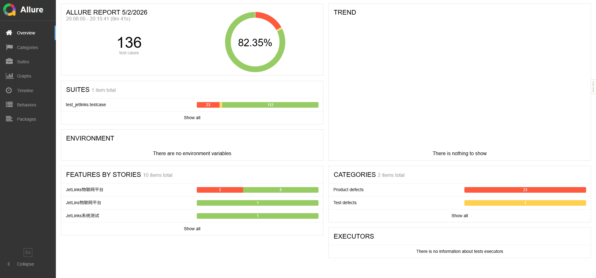
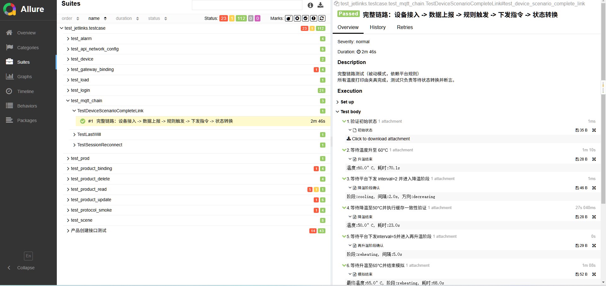
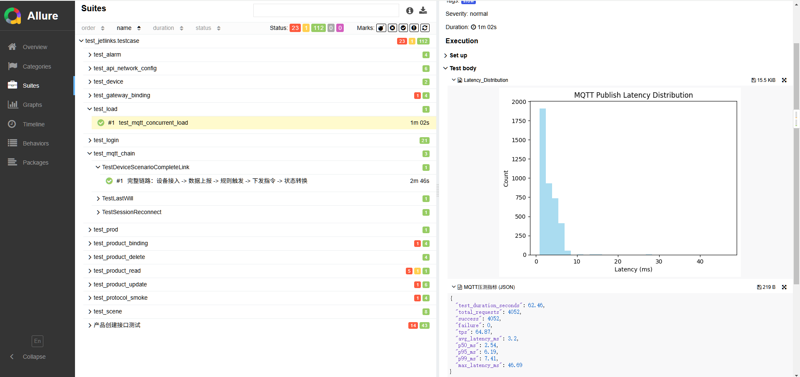

# IoT 物联网平台自动化测试框架

基于 JetLinks 社区版的端到端质量保障体系，覆盖功能测试、协议可靠性、数据一致性及性能压测，集成 CI/CD 全自动流水线。

# 目录结构
iot-test-framework/
├── docker/                     # Docker Compose 配置文件（含 CI 端口覆写）
├── test_jetlinks/              # 测试代码根目录
│   ├── common/                 # API 客户端封装、MQTT 模拟器
│   ├── testcase/               # 全部测试用例
│   ├── protocol/               # JetLinks协议
│   ├── conftest.py             # 全局 fixtures（设备、产品、绑定等）
│   ├── run_tests.py            # 一键测试脚本（跨平台）
│   └── requirements.txt        # 依赖清单
├── .github/workflows/ci.yml    # GitHub Actions 自动化流水线
└── README.md

# 核心特性
- **功能覆盖**：产品 CRUD 参数化（异常值/边界值）、协议解析、网关绑定、规则引擎
- **端到端全链路测试**：覆盖 IoT 设备接入的完整生命周期
  - **环境准备**：自动创建产品、网关、协议、绑定接入网关、配置 MQTT 认证、添加物模型、注册设备并启用
  - **规则联动**：动态创建场景联动规则，设定温度阈值 → 自动下发心跳间隔修改指令
  - **设备行为模拟**：MQTT 协议设备上线 → 周期性属性上报 → 接收平台指令并实时调整工作状态（升温/降温）
  - **状态闭环验证**：校验设备在多阶段（升温→降温→再升温）中的温度、心跳间隔、状态的正确性
  - **数据一致性**：通过 API 即时查询最新属性和遥测日志，确认数据从上报到存储的完整性
- **协议可靠性**：遗嘱消息 (LWT)、会话保持与重连（下行指令缓存 + 上行数据重传）
- **性能压测**：多线程模拟 100 设备并发上报，统计 TPS、P50/P95/P99 延迟，生成分布直方图
- **CI/CD**：GitHub Actions 自动启动 Docker 全栈 → 运行测试 → 生成 Allure 报告 → 部署到 GitHub Pages
- **工程化**：pytest 标记分组、fixture 资源自动管理、环境变量区分本地/CI、一键跨平台启动脚本

# 快速开始
1. 克隆仓库并启动服务
   git clone https://github.com/piaqiahia/iot-test-framework.git
   cd iot-test-framework/docker
   docker compose -f docker-compose.yml -f docker-compose.ci.yml up -d

2. 等待平台就绪（约 60 秒，可通过 curl http://localhost:8848 确认）

3. 进入测试目录并安装依赖
   cd ..                        # 回到项目根目录
   pip install -r test_jetlinks/requirements.txt

4. 运行测试（在项目根目录执行，需设置 PYTHONPATH）
   Windows PowerShell：
   $env:PYTHONPATH = (Get-Location).Path
   pytest --alluredir=test_jetlinks/allure-results -s test_jetlinks 

5. 查看报告
   cd test_jetlinks
   allure serve allure-results
# 报告截图（部分）
**报告首页**

**端到端全链路测试**

**多线程模拟100台设备并发压测**

## 🐛 发现的缺陷（部分）

| # | 模块  | 缺陷描述 | 严重程度 | 根因分析 |
|---|-----|---------|---------|---------|
| 1 | 产品绑定| 接口可绑定不存在的网关ID | 高 | 后端缺少网关真实性校验 |
| 2 | 产品更新 | 允许将产品名称更新为空 | 高 | 必填字段校验缺失 |
| 3 | 产品创建 | 分类名称存在SQL注入风险 | 致命 | 输入过滤不完整 |
| 4 | 产品创建 | 后端未校验产品名称长度 | 中 | 前后端校验不一致 |